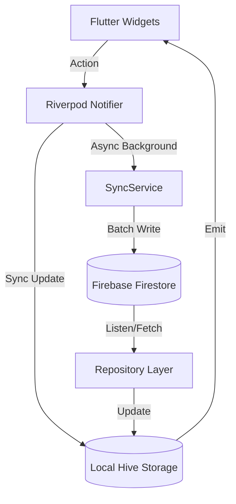
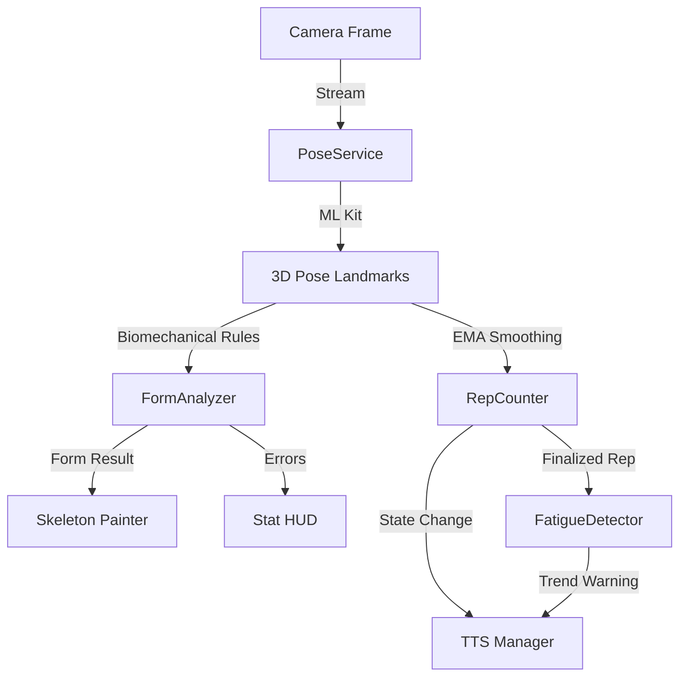

# Gym Rank Architecture

This document provides a deep technical dive into the systemic design and algorithmic foundations of the **Gym Rank** platform.

## 🏗️ High-Level Design: "Hybrid-Zero" State

Gym Rank employs a **Hybrid-Zero** state management approach. "Zero" refers to the zero-latency goal for UI operations, achieved by prioritizing local persistence (`Hive`) as the source of truth, while asynchronous synchronization tasks maintain parity with the remote cloud (`Firestore`).

### State Flow Diagram

## 🧠 Algorithmic Foundations

### 1. ELO Ranking Algorithm
The ELO score (0–999) is not a simple representation of weight lifted, but a measure of **relative athletic capacity** over time.

*   **Raw Volume Input**: $V_{raw} = \sum (\text{Best Set Volume} \times \text{Muscle Multiplier} \times 0.01)$
*   **Compression Function**: $ELO = 999 \times (1 - \frac{1}{1 + \frac{V_{raw}}{k}})$
    *   Where $k$ is the "Resistance Factor" (currently set to 5000), which dictates how quickly the rank increases early on.

#### Muscle Group Multipliers
Compound lifts are weighted more heavily to reflect their impact on total systemic stress:
| Muscle Group | Multiplier (x) |
| :--- | :--- |
| **Quads** | 1.5 |
| **Back** | 1.4 |
| **Chest** | 1.3 |
| **Legs/Hams** | 1.3 |
| **Biceps/Triceps** | 0.9 |

### 2. Muscle Recovery Model
Recovery is calculated per muscle group based on the time-difference ($\Delta t$) since the last session involving that muscle.

*   **Phase 1 (0–24h)**: High Inflammation (0–60% recovery)
*   **Phase 2 (24–48h)**: Repair (60–90% recovery)
*   **Phase 3 (48–72h)**: Supercompensation (90–100% recovery)
*   **Formula**: $\text{Rec}(\Delta h) = \begin{cases} 100 & \text{if } \Delta h \ge 72 \\ 90 + \frac{\Delta h - 48}{2.4} & \text{if } 48 \le \Delta h < 72 \\ 60 + \frac{\Delta h - 24}{0.8} & \text{if } 24 \le \Delta h < 48 \\ \frac{\Delta h}{0.4} & \text{if } \Delta h < 24 \end{cases}$

---

## 👁️ AI Pose Analysis Pipeline

The AI Pose Tracker follows a synchronous, low-latency pipeline to process camera frames and provide biomechanical feedback.

### Frame Processing Pipeline

### Biomechanical Algorithms
1.  **3D Angle Calculation**: Uses spherical coordinates to calculate the angle between three landmarks ($A, B, C$) in 3D space:
    $\theta = \arccos\left(\frac{\vec{BA} \cdot \vec{BC}}{|\vec{BA}| |\vec{BC}|}\right)$
2.  **Relative Depth Analysis**: Uses the landmark $Z$-coordinate (relative distance to the camera) to detect sagittal plane errors (e.g., hip sagging during a push-up) that are not visible in 2D $X, Y$ projections.
3.  **Hysteresis state transition**: To minimize noise, state changes (e.g., "In Rep" vs "Out of Rep") are only triggered when the smoothed angle crosses a threshold and stays beyond a secondary "buffer" zone (the hysteresis).

---

## 🔐 Security Architecture

### Role-Based Access Control (RBAC)
Access to management dashboards and restricted operations is protected at two layers:
1.  **Client-Side Guards**:
    -   **Global Admin**: Checked via `profile.isAdmin`. Grants access to `AdminDashboardScreen`.
    -   **Gym Owner**: Checked via `profile.managedGym != null`. Grants access to `GymOwnerDashboardScreen` for a specific location.
2.  **Server-Side (Firestore Rules)**:
    -   **Global Admin Rule**: `get(/databases/$(database)/documents/users/$(request.auth.uid)).data.isAdmin == true`
    -   **Gym Owner Rule (Read Only)**: Allows users with `managedGym` to read data for members belonging to that specific gym ID.
    -   **Promotion Block**: Prevents non-admins from updating the `isAdmin` or `managedGym` fields.

### Onboarding Enforcement
The `AuthWrapper` acts as an entry-gate. It monitors the completion status of the mandatory profile (`username`, `weight`, `height`, `gym`) through a two-stage verification:
1.  **Local Check**: If local state is already complete, the app enters immediately for a zero-latency experience.
2.  **Remote Priority**: If local state is incomplete, the app **waits** for a remote Firestore sync (`latestProfileProvider`) to confirm if the user's data exists in the cloud. This prevents the "setup flicker" where an existing user might briefly see the onboarding screen.

Users with truly empty or incomplete profiles are directed to the `CompleteProfileScreen`, where they must set their mandatory metrics.

---

## 🛠️ State Management Strategy

### Providers
- **`profileProvider`**: The primary watcher for the current user's data. Emits updates immediately on local change.
- **`latestProfileProvider`**: A `FutureProvider` used during initialization and security checks to force a remote sync and verify the user's status (e.g., checking for bans).
- **`workoutHistoryProvider`**: Manages the list of `WorkoutSession` objects, derived from local storage with lazy remote loading.
